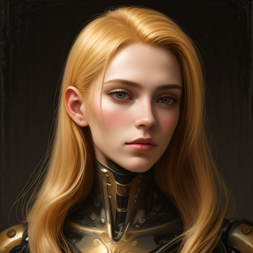

# SD1.5-LCM.Axera

基于 StableDiffusion 1.5 LCM 项目，展示该项目在 Axera 芯片上部署的流程。

支持芯片：
- AX650N

原始模型请参考
- [Latent Consistency Model (LCM) LoRA: SDv1-5](https://huggingface.co/latent-consistency/lcm-lora-sdv1-5)
- [Dreamshaper 7](https://huggingface.co/Lykon/dreamshaper-7)

## 模型转换

请参考[模型转换文档](model_convert/README.md)

## 运行

- 将编译好的 `unet.axmodel`, `vae.axmodel` 模型拷贝到 `./models` 路径下
- 将 `Dreamshaper 7` 仓库中的 `text_encoder` 文件夹拷贝到 `./models` 路径下
- 运行 `main.py`

**Input Prompt**
```
Self-portrait oil painting, a beautiful cyborg with golden hair, 8k
```

**Output**
```
root@ax650:~/samples/sd1.5-lcm.axera# python3 main.py
prompt: Self-portrait oil painting, a beautiful cyborg with golden hair, 8k
text_tokenizer: ./models/tokenizer
text_encoder: ./models/text_encoder
unet_model: ./models/unet.axmodel
vae_model: ./models/vae.axmodel
time_input: ./models/time_input.npy
save_dir: ./lcm_lora_sdv1_5_axmodel.png
text encoder take 1659.5592498779297ms
load models take 1725.5077362060547ms
unet once take 434.7350597381592ms
unet once take 434.8788261413574ms
unet once take 434.51476097106934ms
unet once take 434.57746505737305ms
unet loop take 1745.5813884735107ms
vae inference take 924.3650436401367ms
save image take 1342.8122997283936ms
root@ax650:~/samples/sd1.5-lcm.axera#
```

**Output Image**



## 相关项目

NPU 工具链 [Pulsar2 在线文档](https://pulsar2-docs.readthedocs.io/zh-cn/latest/)

## 技术讨论
Github issues
QQ 群: 139953715

## 免责声明

- 本项目只用于指导如何将 [Latent Consistency Model (LCM) LoRA: SDv1-5](https://huggingface.co/latent-consistency/lcm-lora-sdv1-5) 开源项目的模型部署在 AX650N 上
- 该模型存在的固有的局限性，可能产生错误的、有害的、冒犯性的或其他不良的输出等内容与 AX650N 以及本仓库所有者无关
- [免责声明](./Disclaimer.md)
